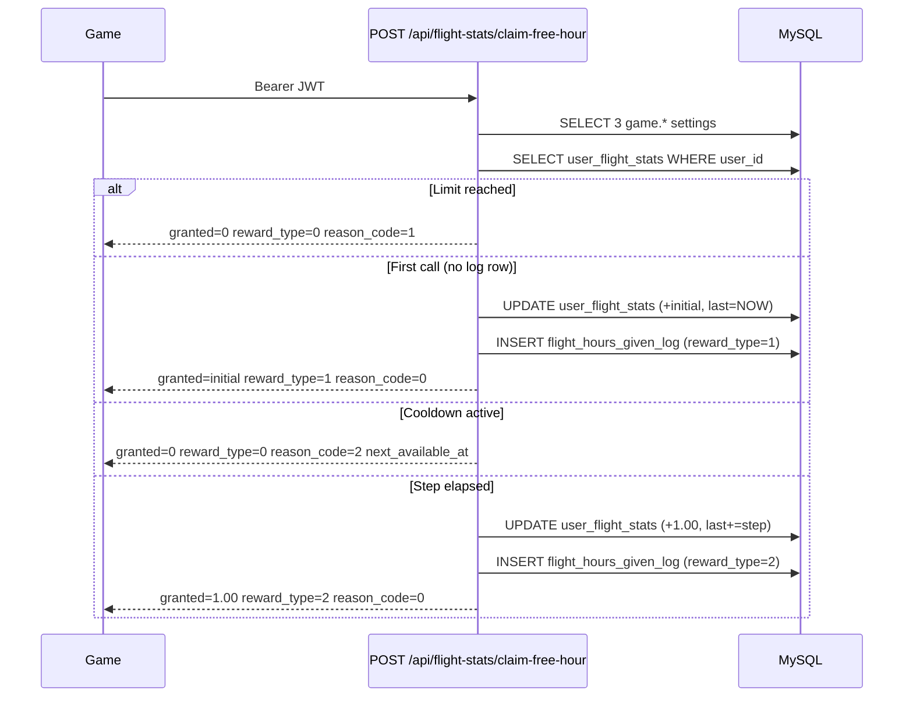

# SimFlightPro - Free Flight Hours Reward API

This endpoint lets the game grant free flight hours to a player based on system-wide rules configured by the admin.

- API Base URL: `https://api.simflightpro.com/api` (production) or `http://localhost:3011/api` (dev)
- Authentication: `Authorization: Bearer <JWT>` (the JWT already encodes `id` = userId; the API resolves the user from the token, no `userId` in the body)
- Content-Type: `application/json`

---

## 1. Endpoint

```
POST /api/flight-stats/claim-free-hour
```

The game calls this endpoint to attempt to grant the authenticated user one free flight hour (or the initial bonus on the first call). The API decides whether to grant, skip, or cap based on `system_settings` and the user's current state in `user_flight_stats`.

### 1.1 Request

- Headers:
  - `Authorization: Bearer <JWT>` (required)
  - `Content-Type: application/json`
- Body: empty (`{}` is accepted)

### 1.2 Response (200 OK)

```json
{
  "granted": 1.00,
  "reward_type": 2,
  "free_flight_hours_given_total": 4.00,
  "free_flight_hours_remaining_limit": 6.00,
  "purchased_flight_hours": 5.00,
  "available_flight_hours": 4.25,
  "next_available_at": "2026-05-12T13:26:11.000Z",
  "reason_code": 0
}
```

| Field | Type | Description |
|---|---|---|
| `granted` | number | Amount of free flight hours credited in this call (`0.00` if nothing was granted). |
| `reward_type` | number | `0` = none, `1` = initial bonus, `2` = periodic step. |
| `free_flight_hours_given_total` | number | Cumulative free hours granted to this user by this system. |
| `free_flight_hours_remaining_limit` | number | Remaining free hours the user can still receive (`limit - total`). |
| `purchased_flight_hours` | number | Total credited hours on the account (purchased + rewarded). |
| `available_flight_hours` | number | Flyable balance = `purchased_flight_hours - total_flight_hours`. |
| `next_available_at` | string (ISO 8601) or `null` | UTC timestamp when the next periodic step becomes claimable. `null` only when limit is reached and no prior grant exists. |
| `reason_code` | number | `0` = granted, `1` = cumulative limit reached, `2` = cooldown active. |

### 1.3 Error responses

| Status | Body | When |
|---|---|---|
| `401` | `{ "error": "Not authenticated" }` | Missing/invalid Bearer token. |
| `403` | `{ "error": "<account disabled message>" }` | User is disabled (`users.is_enabled = 0`). |
| `500` | `{ "error": "Failed to claim free flight hour" }` | Unexpected server error. Check API logs. |
| `500` | `{ "error": "Reward settings missing or invalid" }` | One or more of the three `system_settings` keys is missing or non-numeric. |

---

## 2. Behavior

The endpoint enforces these rules in order:

1. **Cumulative limit check**: if `free_flight_hours_given_total >= game.flight_hours_reward_limit`, returns `granted = 0`, `reason_code = 1`.
2. **Initial bonus** (first call only): if the user has no row in `flight_hours_given_log` and `free_flight_hours_given = 0`, grants `min(game.flight_hours_initial_reward, remaining_limit)` with `reward_type = 1` and sets `last_free_flight_hour_at = NOW()`.
3. **Periodic step**: if `NOW() - last_free_flight_hour_at >= game.flight_hours_step_reward` hours, grants `min(1.00, remaining_limit)` with `reward_type = 2` and advances `last_free_flight_hour_at` by `game.flight_hours_step_reward` hours (preserves accumulated entitlement across late calls). The returned `next_available_at` is the *new* `last_free_flight_hour_at + step_reward` (i.e. two intervals after the old timestamp).
4. **Cooldown**: otherwise returns `granted = 0`, `reason_code = 2`, and `next_available_at = last_free_flight_hour_at + step_reward`.

In all cases the response always includes `next_available_at` except when the cumulative limit is reached and there was never a prior grant (`null`).

The granted amount is also added to `user_flight_stats.purchased_flight_hours`, so it is immediately reflected in `available_flight_hours` (and is consumed by future flights as usual).

---

## 3. System Settings

Configured in `system_settings` (admin panel or DB). All values are numeric.

| `key_name` | Default | Description |
|---|---|---|
| `game.flight_hours_step_reward` | `3` | Real-world hours between periodic grants (cooldown interval). |
| `game.flight_hours_reward_limit` | `10` | Maximum total free hours a single user can ever receive from this system. |
| `game.flight_hours_initial_reward` | `1` | Free hours given on the user's first call to this endpoint. |

Changing these values takes effect on the next call; previously granted hours are not reverted.

---

## 4. Persistence

### 4.1 `user_flight_stats` (extended)

```sql
ALTER TABLE user_flight_stats
  ADD COLUMN free_flight_hours_given DECIMAL(10,2) NOT NULL DEFAULT 0.00,
  ADD COLUMN last_free_flight_hour_at TIMESTAMP NULL DEFAULT NULL;
```

- `free_flight_hours_given` - cumulative free hours given to this user by this system (used for limit check).
- `last_free_flight_hour_at` - timestamp of the last successful grant (used for cooldown).

### 4.2 `flight_hours_given_log` (new)

```sql
CREATE TABLE flight_hours_given_log (
  id INT AUTO_INCREMENT PRIMARY KEY,
  user_id INT NOT NULL,                         -- FK users(id) ON DELETE CASCADE
  amount DECIMAL(10,2) NOT NULL,
  reward_type TINYINT NOT NULL,                 -- 1 = initial, 2 = periodic
  step_interval_hours DECIMAL(10,2) NOT NULL,   -- snapshot of game.flight_hours_step_reward at grant time
  total_given_after DECIMAL(10,2) NOT NULL,     -- free_flight_hours_given after this grant
  created_at TIMESTAMP DEFAULT CURRENT_TIMESTAMP,
  INDEX idx_fhgl_user (user_id),
  INDEX idx_fhgl_created (created_at)
);
```

Only this system writes to this table. Hours bought through Stripe or other flows are tracked elsewhere (`purchase_history`).

---

## 5. Examples

### 5.1 cURL

```bash
curl -X POST "https://api.simflightpro.com/api/flight-stats/claim-free-hour" \
  -H "Authorization: Bearer eyJhbGciOi..." \
  -H "Content-Type: application/json" \
  -d "{}"
```

### 5.2 C# (game client)

```csharp
public class ClaimFreeHourResponse
{
    public decimal granted { get; set; }
    public int reward_type { get; set; }                          // 0 = none, 1 = initial, 2 = periodic
    public decimal free_flight_hours_given_total { get; set; }
    public decimal free_flight_hours_remaining_limit { get; set; }
    public decimal purchased_flight_hours { get; set; }
    public decimal available_flight_hours { get; set; }
    public DateTime? next_available_at { get; set; }              // nullable (null when limit reached with no prior grant)
    public int reason_code { get; set; }                          // 0 = granted, 1 = limit_reached, 2 = cooldown
}

public async Task<ClaimFreeHourResponse> ClaimFreeHourAsync(string jwt)
{
    using var http = new HttpClient();
    http.DefaultRequestHeaders.Authorization =
        new AuthenticationHeaderValue("Bearer", jwt);

    var resp = await http.PostAsync(
        "https://api.simflightpro.com/api/flight-stats/claim-free-hour",
        new StringContent("{}", Encoding.UTF8, "application/json"));

    resp.EnsureSuccessStatusCode();
    var json = await resp.Content.ReadAsStringAsync();
    return JsonSerializer.Deserialize<ClaimFreeHourResponse>(json);
}
```

### 5.3 Recommended call cadence

- Call on user login to the game.
- Call again periodically (e.g., once per session start, or hourly while connected). The endpoint is safe to call as often as desired - it self-throttles via `last_free_flight_hour_at`.
- Use `next_available_at` to show a countdown in the UI; do not call before that time unless the user is opening the app again.

---

## 6. Sequence



---

## 7. Notes

- All numeric enums in the request/response are represented as numbers (`reward_type`, `reason_code`), not strings.
- The endpoint is idempotent against accidental double-calls within the same cooldown window: the second call returns `granted = 0`, `reason_code = 2`.
- The endpoint never decreases `purchased_flight_hours`; flights consume hours through the existing flight-logs pipeline.
- If `game.flight_hours_reward_limit` is increased later, the user becomes eligible again automatically on the next call.
